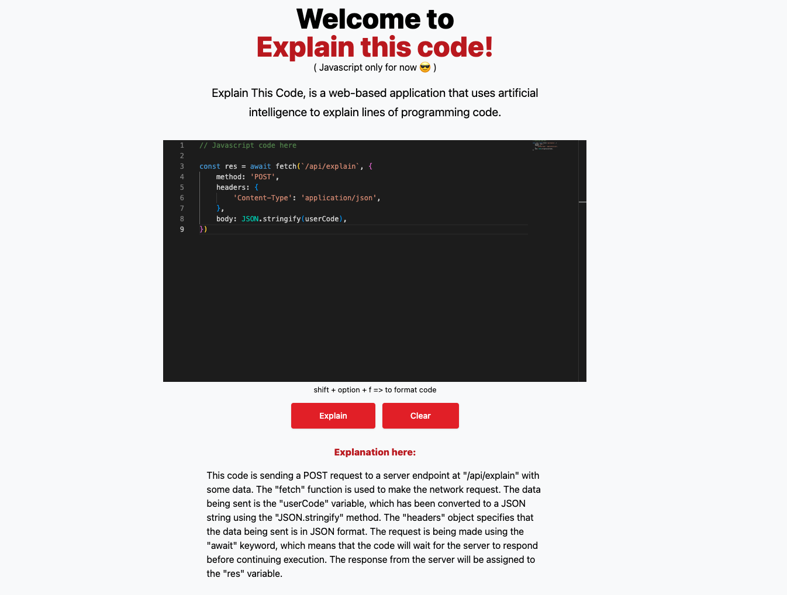

# Explain This Code 😎

Explain This Code, is a web-based application that uses artificial intelligence to explain lines of
programming code. 

It is a valuable tool for developers of all levels of experience, from beginners
learning new programming languages to experienced developers debugging code.

## Benefits:

Reduced time to understand code: Explain Code can help you understand code faster by providing clear and concise explanations of each line. This can save you time and help you focus on other tasks, such as debugging or writing new code.

Improved code quality: When you understand the code you're writing, you're less likely to make mistakes. This can lead to higher-quality code that is less likely to have bugs.

## Technologies used

- Next.js 
- React.js
- Tailwind
- Typescript
- Openai - API to interact with Chat GPT
